# PostgreSQL

```
username: bishaltwr
password: MjMzNjMtYmlzaGFs
```

- Downloading setup file and running:
```bash
wget https://cf-courses-data.s3.us.cloud-object-storage.appdomain.cloud/IBM-DB0231EN-SkillsNetwork/labs/Final%20Assignment/postgres-setup.sh

chmod +x  ./postgres-setup.sh

./postgres-setup.sh
```

## Task 1.1: Find the settings in PostgreSQL

- What is the maximum number of connections allowed for the postgresSQL for this server?
    - Answer: 100
- postgresql.conf file

> Location: /home/project/postgres/data/pgdata/postgresql.conf

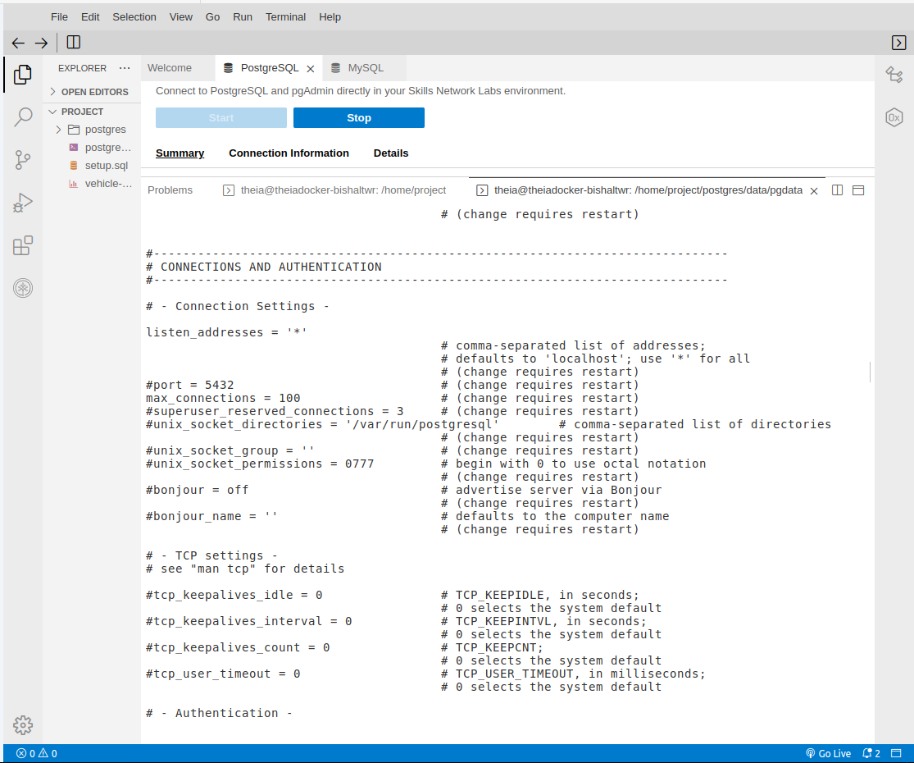

# Exercise 1.2 User management
- Perform using CLI not GUI

## Task 1.2: Create a User

```bash
psql --username=postgres --host=localh 
```


## Task 1.3 - Create a Role


## Task 1.4 - Grant privileges to role


## Task 1.5 - Grant role to an user


# Exercise 1.3 - Backup

## Task 1.6 - Backup a database on PostgreSQL server

- Backup tolldata using PGADMIN GUI


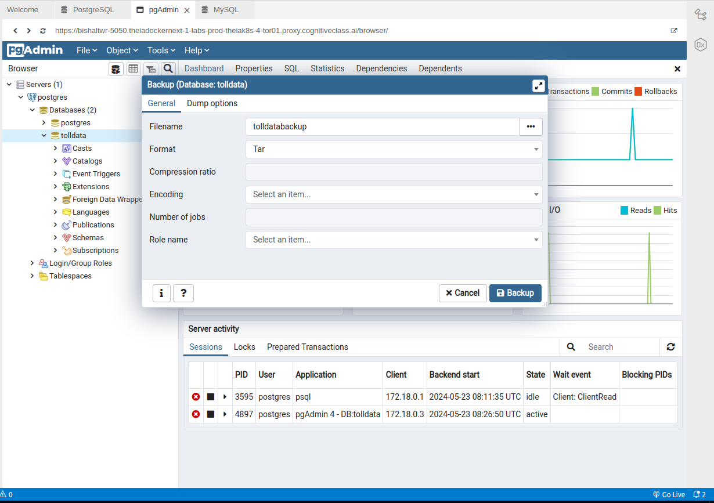

# MySQL

# Exercise 2.1 - Setup the lab environment

```
username: bishaltwr
password: MTA2OTItYmlzaGFs
```

## Task 2.1 - Restore MySQL server using a previous backup

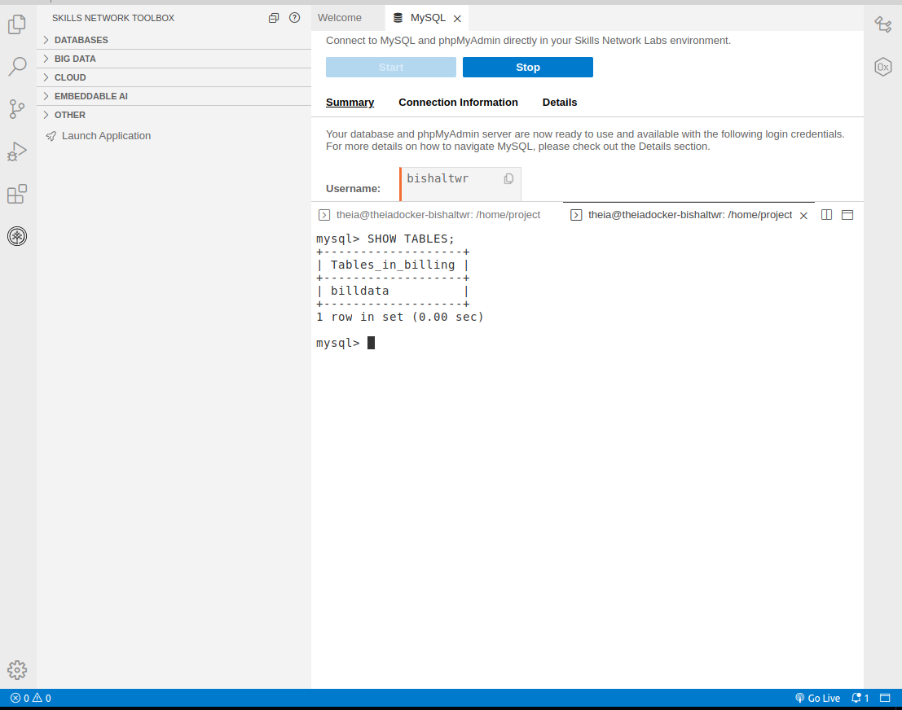

## Task 2.2 - Find the table data size

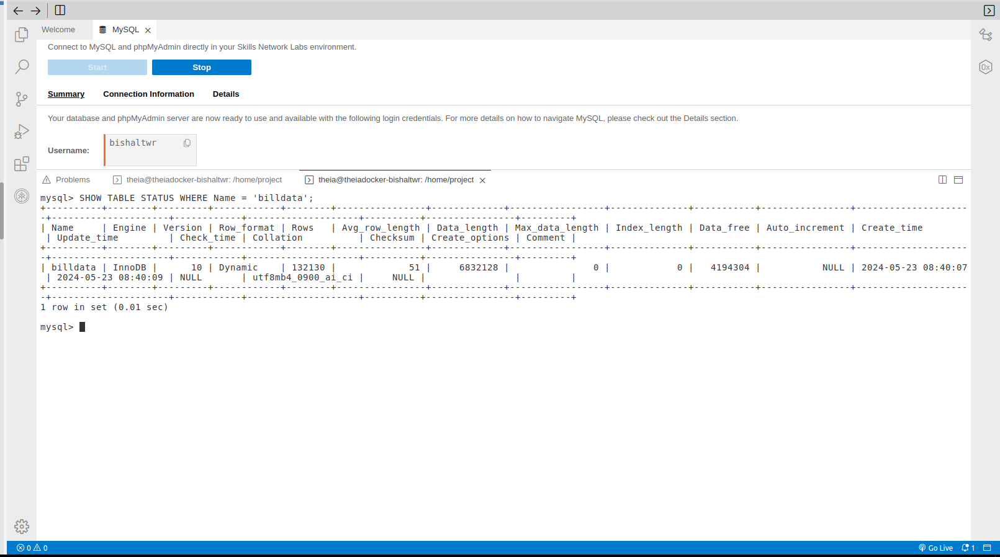

# Exercise 2.3 - Indexing

## Task 2.3 - Baseline query performance

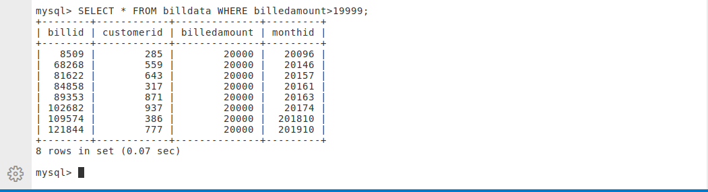

## Task 2.4 - Create an index

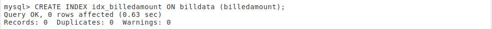

## Task 2.5 - Document the improvement in query performance

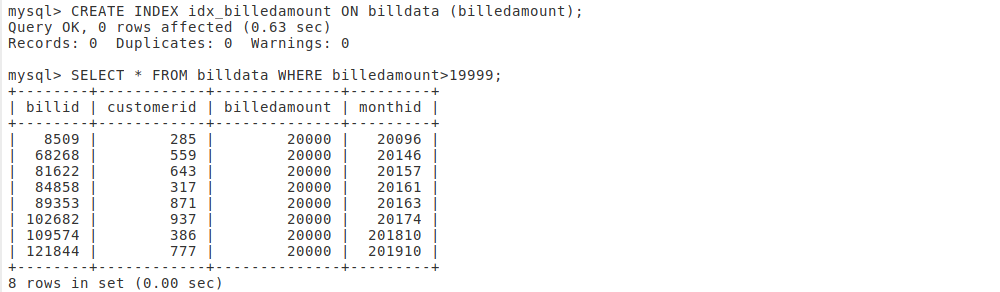

# Exercise 2.4 - Storage Engines

## Task 2.6 - Find supported storage engines

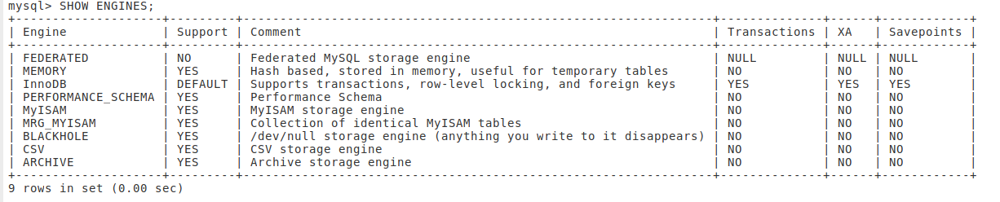

## Task 2.7 - Find the storage engine of a table 

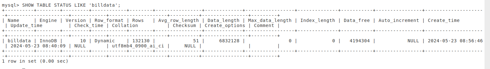

# Exercise 3.1 - Prepare the lab environment

- Download the file billing.csv

## Task 3.1 - Restoree the table billing
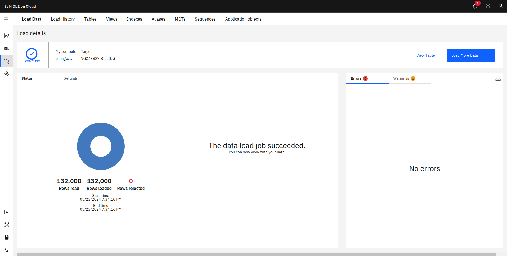

# Exercise 3.3 - Create a view

## Task 3.2 - Create a view named basicbilldetails with columns customerid, month, billedamount

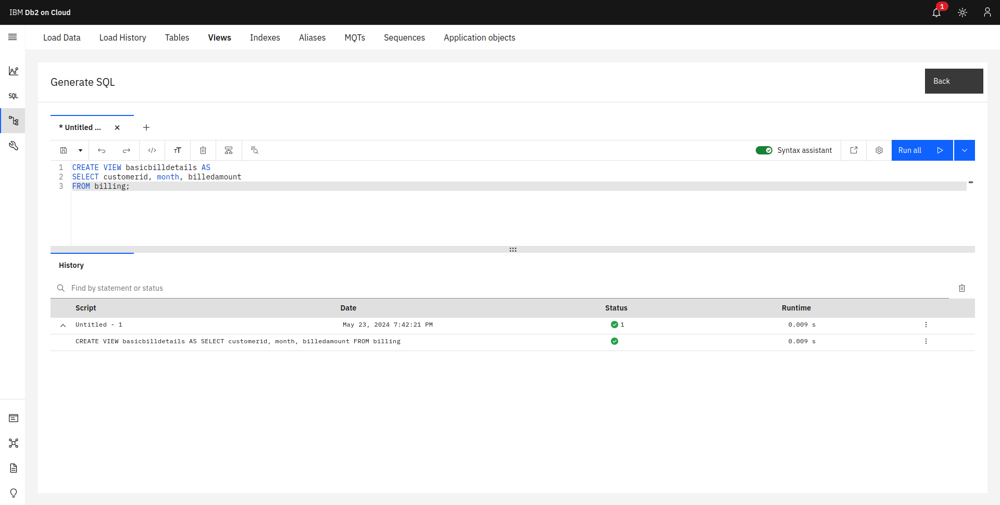

# Exercise 3.4 - Indexing

## Task 3.3 - Baseline query performance

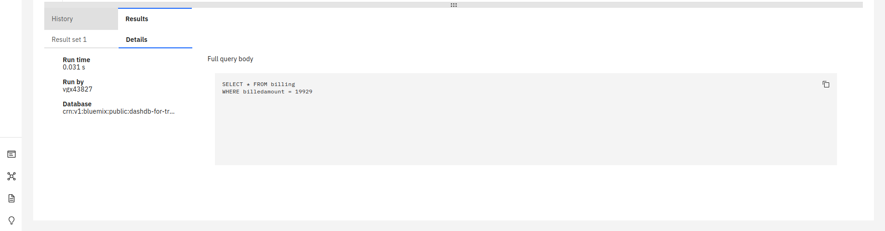

## Task 3.4 - Create an index

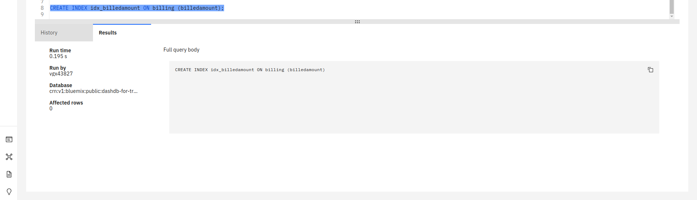


## Task 3.5 - Document the improvement in query performance

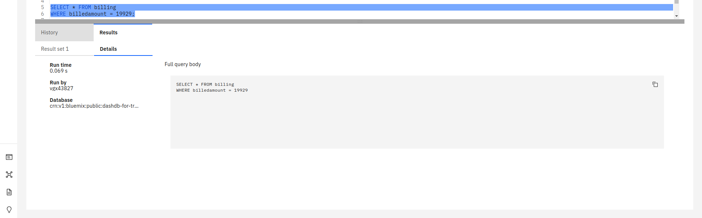