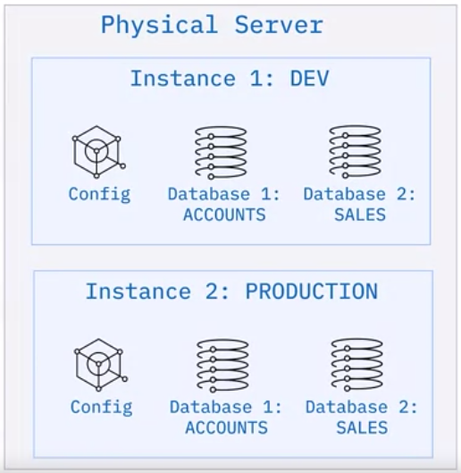

# Database Objects

## Hierarchy of database objects
> Helps maintain security, maintenance and accessibility
- Instance
Is a logical boundary for db,objects and configuration.
Provides unique server environment.
Allows isolation between dbs.
Not all dbms use concept of instance.
In cloud environment, instance refers to a running copy of a service.

<hr>

- Database
<hr>

- Schema
Organize db objects.
Default schema is the user schema.
System scheema contains db configuration information.

<hr>

- Database objects
    - table
    - constriants: Rules
    - indexes: Pointers to improve performance
    - Keys: Identifies row in table
    - Views: Virtual table, stored query
    - Alias: Alternative name
    - Event: DML or DDL action on the db that initiates a trigger
    - Trigger: Set of events that are automatically executed upon certain event's occurance.
    - log Files: store information about transactions
<hr>

> Database design includes defining db objects and their relationships with each other.

> DB objects can be done with graphical tools, scrips or APIs.

## System Objects
- Metadata is information about db.
- Known as system db, system schema, catalog.
- They store name of db, data types, access privileges.
- You can query the metadata table. Different names:
    - DB2 has catalog(table and permission) and directory(control data and recovery data)
    - MySQL uses system schema (Information_Schema, MySQL, Performance_schema, sys). Each schema has read only tables.
    - PostgreSQL has system catalog.

## Configuration files:
- Configuration files: Parameters set during installation.
- Installation creates configuration files
- Can include:
    - Location of data
    - Port information
    - Settings like memory allocation, connection timeout, ...
- DB2: SQLDBCONF, MySQL: my.ini & my.cnf, PostgreSQL: Postgresql.conf

- To modify configuration files:
    - On-premises
        - Stop, Modify config, start
    - Cloud-based
        - Use graphical tools to modify, no need to stop, db scales dynamically.

# Database Storage:
> Need to plan by determining capacity

- In cloud based, you can scale up or down in terms of storage.
- Physical storage is separated from logical.

- TableSpaces contain db objects. They define mapping between logical and physical storage. Contain one or more db objects.

- Table spaces separate logical and physical storage.
- Advantages of tablespaces:
    - Performance : heavily used file on fast media
    - Recoverability : Makes backup and restore more convenient
    - Storage management : Extend the datafiles and containers as required.

- Some RDBMS allow storage groups.
    - Hot Storage Group accessed frequently
    - Warm Storage Group accessed somewhat frequently
    - Cold Group accessed rarely.

- Partitioned rdbms => Data is managed accross multiple db partitions.
- Large tables can be partitioned.
- Used in data warehousing situations.

# Storage Engines in MYSQL
> A storage engine is a software component that handles the operations that store and manage information in a database.

- MySQL is unusual as it supports multiple storage engines.

| Storage Engine | Description |
| --- | --- |
| InnoDB | Default storage engine for MySQL 5.5 and later. Suitable for most data storage scenarios. Provides ACID-compliant tables and FOREIGN KEY referential-integrity constraints. Supports commit, rollback, and crash recovery capabilities to protect data. Supports row-level locking. Stores data in clustered indexes which reduces I/O for queries based on primary keys. |
| MyISAM | Manages non-transactional tables. Provides high-speed storage and retrieval. Supports full-text searching. |
| MEMORY | Provides in-memory tables, formerly known as HEAP. Stores all data in RAM for faster access than storing data on disks. Useful for quick lookups of reference and other identical data. |
| MERGE | Treats groups of similar MyISAM tables as a single table. Handles non-transactional tables. |
| EXAMPLE | Allows developers to practice creating a new storage engine. Allows developers to create tables. Does not store or fetch data. |
| ARCHIVE | Stores a large amount of data. Does not support indexes. |
| CSV | Stores data in Comma Separated Value format in a text file. |
| BLACKHOLE | Accepts data to store but always returns empty. |
| FEDERATED | Stores data in a remote database. |

```sql
SHOW ENGINES; --this shows the list of engines with support 
CREATE TABLE Products (i INT) ENGINE = INNODB; -- This can be used to choose storage engine
SET default_storage_engine=ARCHIVE;
ALTER TABLE Products ENGINE = MEMORY;
```
> InnoDB is suitable for most data storage needs but setting and working with different storage engines in MYSQL gives you more control over how your data is stored and accessed. Using the most appropriate storage engine for your data brings operational benefits like faster response times or efficient use of available storage.

MjQwMjctYmlzaGFs