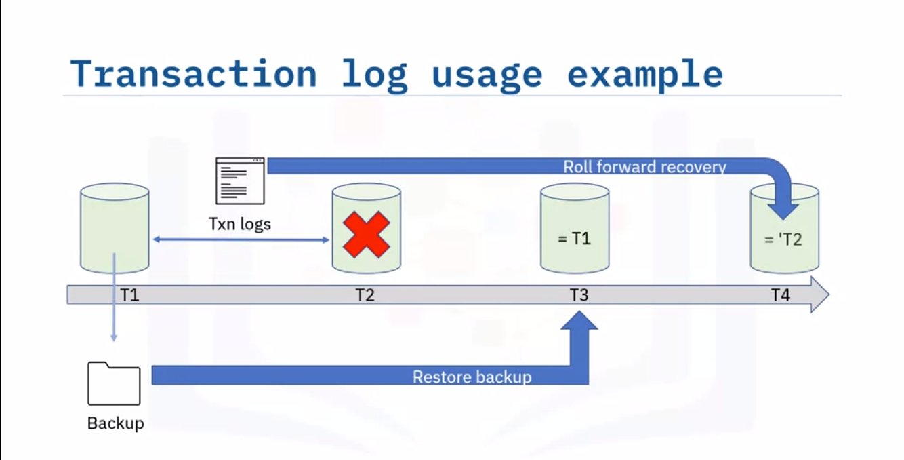
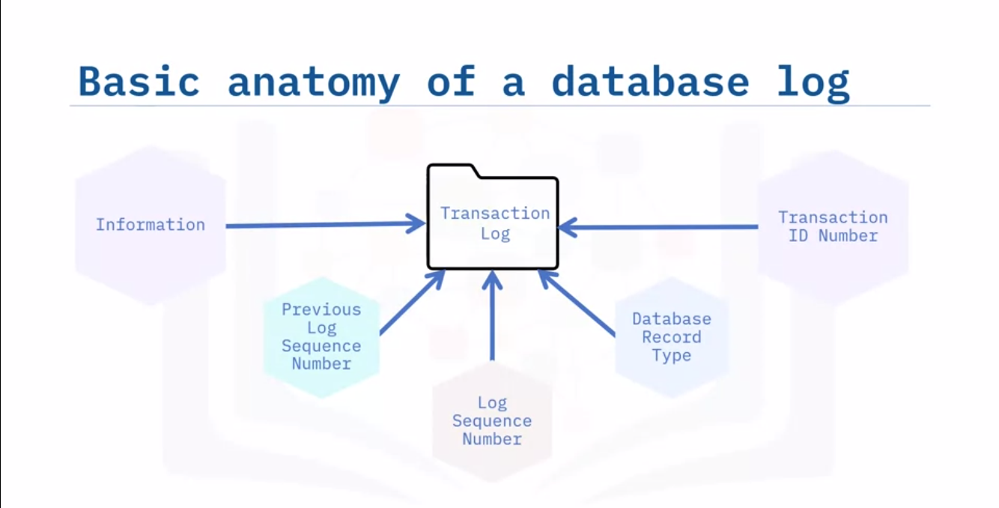

# Backup and Restore databases
> Saving a copy of data and recovering from data loss

## Scenarios where backup and recovery might be necessary:
- After unplanned shutdown
- Accidental deletion
- Data corruption
- Moving data to a different database system
- Sharing data with business partners
- Using a copy of the data for development or test

## Physical vs Logical backup
- Logical backup contains DDL, DML to recreate
    - Can reclaim wasted space
    - Slow and may impact performance
    - Granular : You can backup individual data or table..
    - Backup/resotore, import/export, dump & load utilities

- Physical backup copies physical files, including logs, and configuration
    - smaller and quicker
    - less granular
    - Can only restore to similar RDBMS
    - common for specialized storage and cloud

## What to backup:
- Database
- Schema
- Tables
- Subset of data
- Other objects
> Can customize backup policy(what, how frequently,...)

> Check if backup is valid, check if restore policy works, ensure that backup files are secure

> Other configuration like: <br>
    - compression level (more time, less space for higher compression level) <br>
    - Encryption (Reduces risk of data being compromised, more time)

## Types of backup:

- Full backup
    - backs up all the specified data
    - multiple copies means storing many instances of a large file
    - Only storing one copy risks data loss if file is corrupt
    - Could be needlessly backing up unchanged data
    - Most secure (stored offline)
- Point in time backup
    - Uses logged transactions to restore to an earlier point in time.
    - If issue at 12:25 and last full backup was at 11:20, restore the full backup, apply all transactions before that specific transaction.
    - MySQL calls it binary log, PostgreSQl calls it write ahead log, DB2 calls it transaction log.
- Differential backup
    - A copy of data that has changed since the last full backup was taken. 
    - Small size.
- Incremental backups
    - A copy of data that has changed since the last backup of any type was taken.

## Backup Policies:

- Hot or online backups:
    - Taken when data is in use
    - User can continue to use db but lower performance
    - Can impact integrity
    - Generally in availabe server, faster

- Cold or offline backups:
    - Stop the db and then take backup
    - Eliminates data integrity problem 
    - Can't be used in 24/7 environment as it impact availability
    - Stored in external server, more time

## What should be considered?:

- Frequency:
    - Regularly changing?
    - Size of table

- Schedule:
    - Is data accessed equally across 24-hour day?
    - Is it accessed at weekends?

- Automation

- Backup may need to be enabled in cloud too. (Automatic or Manual)
    - Options depends on provider.
    - Third party solution if dbms doesn't provide it.

## Using DB transaction logs:
> Keep track of transaction that change the db. Can be used to recover.


- You can chage where to store
- Isolate on different volumes from data (recommended)
    - Performance(writes don't conflict) and recoverability
- Log mirroring: Store second copy of log
- Log shipping: automatically send logs somewhere else
- May or maynot be enabled by default


# Security and User management

> Identifying and mitigating risks

- On premise servers:
    - Who has access?
    - What are security measures in place?
- Cloud servers:
    - Providers are responsible (check documentation)
- OS should be secure
    - Regularly patched
    - system hardening (can withstand latest known vulnerability)
    - access monitoring
- RDBMS
    - latest update
    - security features
    - only some have access

> User need to be authenticated and allowed access

## Authentication and authorization

- Authentication is how user verifies that they are who they claim to be
    - Username password
    - biometrics lock
    - External tools like login IDs, two factor authentication etc.

- Authorization is granting privileges to users, groups , roles.
    - On table: select, insert, update, delete, alter table.
    - Principle of least privilege: only allow least privelege required.

- Monitoring:
    - who access what
    - what actions they perform
- Auditing:
    - actual access against a security plan
- Encryption: 
    - Intruder need to decrypt
- There are regulations:
    - Algorithm
    - Key management
- Consider performance impact too

> Even the most secure hardware, RDBMS, and OS can be prone to SQL injections and improper code. So, check those.

## Users, groups and roles

- User is an account.
    - Explicitly need to be granted privilege
    - Can be authenticated internally or externally(using OS)
- User can be grouped
- Roles are collection of privilege
    - Some dbms have predefined or you can have user-defined roles.

- Create roles or groups, assign new member to group, not each
- Principle of least privilege
- Create granular groups

## Managing access

- Privilege can be granted to user, groups or roles.

```sql
GRANT CONNECT TO 'salesteam'; -- Sales team is group
-- OR you can allow a specific user
REVOKE CONNECT TO 'public';
GRANT SELECT ON mydb.table TO 'john'; 
GRANT CREATE TABLE TO 'salesteam';

GRANT VIEW ON mydb.myproc to 'salesteam';
-- You can also grant EXECUTE, ALTER to procedures

REVOKE SELECT ON mydb.mytable TO 'salesteam';
-- After revoke another role can be used by team member to do that
DENY SELECT ON mydb.mytable TO 'salesteam';
-- After deny they can't do that. i.e. it overrides an existing granted permission.
```

## Auditing db activities

> Doesn't directly prevent unauthorized access but helps you identify gaps in security measures and track errors.

- Auditing = recording activity (logs) and reviewing them
- Track and review activity (failed or successful)
- Trigger can be used for logging

## Encrypting data

> Adds a layer of security, last line of defence

- May be required.
- Data at rest should be encrypted (Transparent data encryption) to ensure that malicious users cant use the files.
    - DB level, table level, column (but performance and complexity)

- Symmetric: same key for encryption or decryption
    - Key gone , data gone , your job done

- Assymetric: one public key, one private key.

- Transparent data encryption is not visible to user. Automated.
- Customer managed key => Bring your own key(BYOK)
    - Even db admins cannot access data

- Encryption takes time.
- Assymetric have greater overheads
    - So, mostly symmetric is enough

- Often provided by RDBMS
    - TLS : Transport layer security
    - SSL : Secure socket level
    - Allows enable/disable