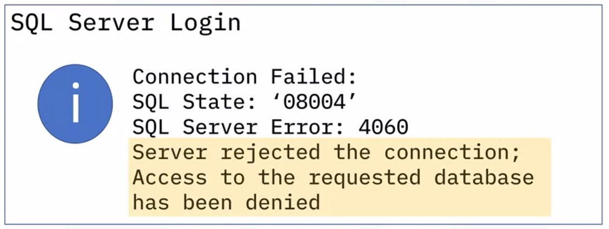
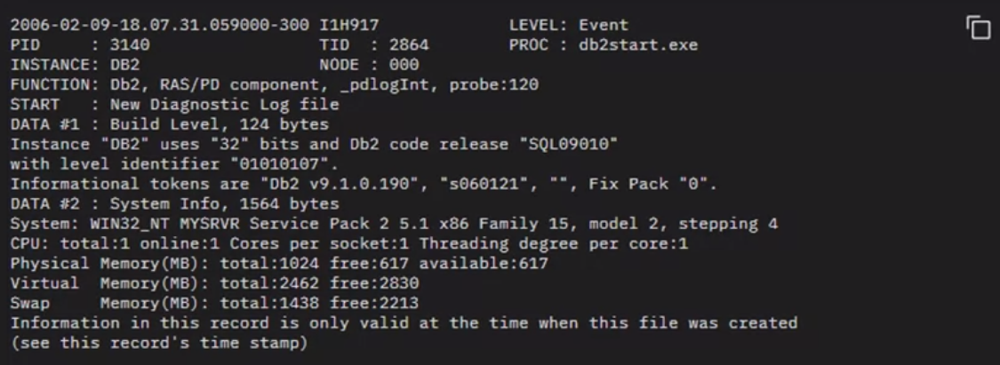
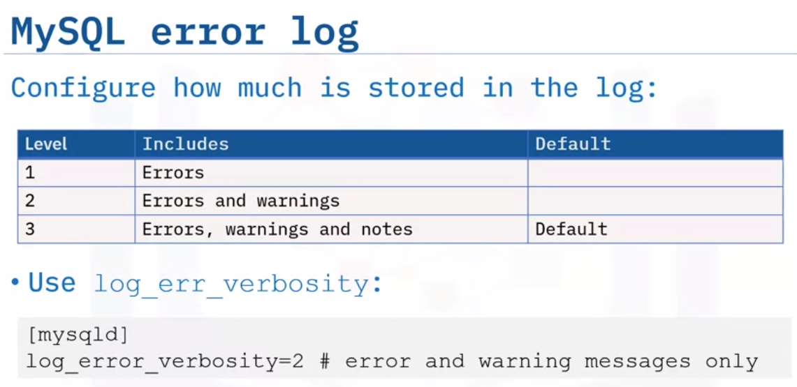

# Troubleshooting
> Identifying and solving problem

## Questions to ask:
- What are the symptoms?
- Where is the problem happening?
- When does the problem happen?
- Under which conditions does the problem happen?
- Is the problem reproducible?

## Common problems are caused by:
- Poor performance:
    - Inadequate hardware (Scaling, horizontal or vertical)
    - Server or db configuration
    - Network connectivity
    - Query and application logic
- Improper configuration
    - Client configuration
        - Check there:
            - Incorrect login, pw or authentication type
            - Incorrect connection config
            - Incorrect driver version
    - Server configuration
        - Check these:
            - Memory
            - Disc space
            - Processing power
            - defragmentation
            - improve storage configuration
            - bugs in Os and RDBMS
    - Database configuration
        - Check these:
            - Database connection (no of connections allowed)
            - Insufficient buffering
            - Indexing
- poor connectivity
    - Server cannot be reached
    - DB instance cannot be reached
    - Client login credentials or security are incorrect
    - Client configuration incorrect
    - Check:
        - Verify server
        - Verify instance of db is running
        - Verify connection(use ping to server ip)
        - Verify client and config

## Tools:
- Monitoring tools
- Dashbords and reports
- Logs

## Status variables, error codes and documentation

- From CMD:
    - `SERVICE MYSQL STATUS`
    -  `SHOW STATUS` #global status or session status variable
    - `SHOW STATUS LIKE 'Key%';` #this can be used too
- GUI:
    - Activity monitor of SQL server
- Error logs:
    - Server and OS log
    - DB error logs:
        - error log
        - event log
        - trace log(optional)

## Error codes:

- Search error code tables on documentation

## Using logs for troubleshooting
> Diagnostic logs track events and errors on db when processing request, used for troubleshooting

- Types:
    - Server logs
    - Device logs
    - Network logs
    - Operating system logs
    - Database logs <== DBA should knooow this
    - Application logs

- Working with log fies:
    - location might be configurable
    - many logs in plain text format
    - some logs may require special tools to read and filter

- Component:
    - Type (error or event)
    - Error message
    - Where
    - Timestamp
    - User's Ip and User Agent
    - Additional details

- In MYSQL
    - general query log
    - slow query log
    - error log

# Automation
> Unattended processes and self-updating procedures, routine jobs, ..

- Version control is necessary
- Scripts can be used to automate
- Cron Jobs, shell scripts

## Advantages
- throughput and productivity
- Improve quality or increase predictability of quality
- Improve consistency of process or product
- Increase consistency of outputs or results
- To free up staff
- provide higher level jobs in automated processes

## Examples:
- Health check
- DB tasks
- Alert log files cleanup
- Trace file cleanup
- Data dictionary statistics (metadata)
- Data configuration check
- Schema object check
- Routine daily tasks (maybe using GUI)

## Automating db testing
> Ensure information in db is correct and running properly within controlled testing environment

- Check schema, table, triggers
- Prevents data loss
- saves aborted transaction data
- prohibits unauthorized access
- Checks data integrity and consistency
- Cheaper , faster , secure

## Automating reports and alerts

- Reports: Health of db, adress issues/problems, keep track of trends, predict future needs, regular schedule
- Notifications: bring event to attention, raise awareness but not critical issue
- Alerts: urgent issues brought to attention, threshold(warning and critical)

- RDBMS (most) have GUI or CUI or scrips option
- Varies based on RDBMS

